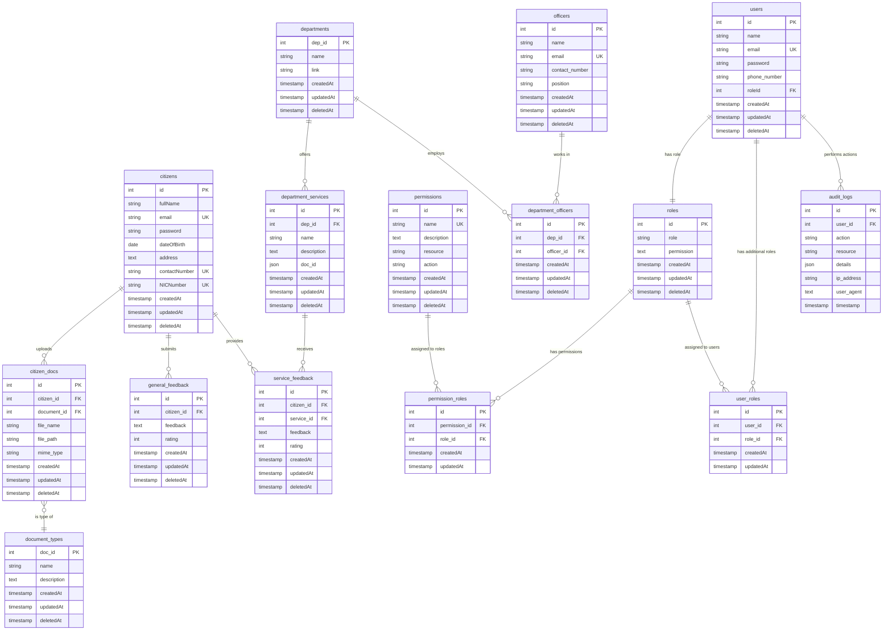

# GovConnect - Developer Documentation

## Table of Contents
1. [Project Overview](#project-overview)
2. [System Architecture](#system-architecture)
3. [API Documentation](#api-documentation)
4. [Database Schema](#database-schema)
5. [Setup & Deployment Guide](#setup--deployment-guide)
6. [Security & Validation](#security--validation)
7. [Developer Notes](#developer-notes)

---

## Project Overview

### Purpose
GovConnect is a comprehensive digital platform that serves as "The Only Portal for All Government Services" in Sri Lanka. The system streamlines government service delivery by providing citizens with a unified interface to access various departmental services, submit documents, track applications, and provide feedback.

### Key Features
- **Citizen Portal**: Registration, authentication, and service access for citizens
- **Administrative Dashboard**: Management interface for government officers and departments
- **Document Management**: Secure upload, storage, and verification of citizen documents
- **Service Management**: Comprehensive catalog of government services across departments
- **Feedback System**: Service feedback and general feedback collection
- **Role-Based Access Control**: Multi-tier authentication and authorization
- **Audit Logging**: Complete activity tracking for compliance and security
- **Multi-Department Integration**: Support for Immigration, Health, Tax, and other departments

### Technologies and Frameworks

#### Frontend
- **React 19.0.0** - Modern UI library with hooks and functional components
- **TypeScript** - Type-safe JavaScript development
- **Vite** - Fast build tool and development server
- **Ant Design (antd) 5.24.4** - Professional UI component library
- **Redux Toolkit** - State management with RTK Query for API calls
- **React Router 7.5.2** - Client-side routing
- **TailwindCSS 4.0.14** - Utility-first CSS framework
- **Formik & Yup** - Form handling and validation
- **React Leaflet** - Interactive maps
- **Chart.js & Recharts** - Data visualization
- **React Query (TanStack)** - Server state management

#### Backend
- **Node.js** - JavaScript runtime environment
- **Express 4.21.2** - Web application framework
- **TypeScript** - Strongly typed JavaScript
- **Sequelize 6.37.5** - ORM for database management
- **MySQL** - Relational database management system
- **JWT (jsonwebtoken)** - Authentication and authorization
- **bcrypt** - Password hashing
- **Multer** - File upload handling
- **Express Validator** - Input validation and sanitization
- **CORS** - Cross-origin resource sharing

#### Development Tools
- **Jest** - Testing framework
- **ESLint** - Code linting and formatting
- **Nodemon** - Development server with auto-restart
- **Sequelize CLI** - Database migrations and seeders
- **Docker Compose** - Local MySQL database setup

---

## System Architecture

### High-Level Architecture


### API Request Flow


### File Upload Flow


### Frontend Architecture
```
src/
├── components/          # Reusable UI components
│   ├── auth/           # Authentication components
│   ├── common/         # Shared components
│   └── layout/         # Layout components
├── pages/              # Page components and routing
├── services/           # API service layer
├── store/              # Redux store and slices
├── hooks/              # Custom React hooks
├── types/              # TypeScript type definitions
├── validation/         # Form validation schemas
└── App.tsx            # Main application component
```

### Backend Architecture
```
api/src/
├── bin/               # Application entry point
├── config/            # Database and application configuration
├── controllers/       # Request handlers and business logic
├── middleware/        # Express middleware functions
├── models/            # Sequelize database models
├── repositories/      # Data access layer
├── routes/            # API route definitions
├── services/          # Business logic services
├── migrations/        # Database schema migrations
├── seeders/           # Database seed data
├── types/             # TypeScript type definitions
├── validation/        # Input validation schemas
├── util/              # Utility functions
└── server.ts          # Express server configuration
```

### Database Architecture
The system uses MySQL with Sequelize ORM, featuring:
- **Multi-table design** with proper relationships
- **Soft deletes** for data integrity
- **Audit logging** for compliance
- **Foreign key constraints** for data consistency
- **Indexed fields** for performance optimization

### Security Architecture
- **JWT-based authentication** with separate tokens for citizens and admin users
- **Role-based access control (RBAC)** with granular permissions
- **Password hashing** using bcrypt with salt rounds
- **Input validation** on all API endpoints
- **CORS configuration** for cross-origin security
- **Audit logging** for all user actions

---

## API Documentation

### Base URL
- Development: `http://localhost:3001`
- Production: `{PRODUCTION_URL}`

### Authentication
All protected endpoints require JWT token in the Authorization header:
```
Authorization: Bearer <token>
```

### Response Format
All API responses follow this standard format:
```json
{
  "message": "Success/Error message",
  "status": 200,
  "error": null,
  "data": {...}
}
```

### Authentication Endpoints

#### POST /auth/register
Register a new admin user.
```json
// Request Body
{
  "name": "John Doe",
  "email": "john@example.com",
  "password": "securePassword123",
  "roleId": 1
}

// Response
{
  "message": "User registered successfully",
  "status": 201,
  "error": null,
  "data": {
    "user": {...},
    "token": "jwt_token_here"
  }
}
```

#### POST /auth/login
Admin user login.
```json
// Request Body
{
  "email": "john@example.com",
  "password": "securePassword123"
}

// Response
{
  "message": "Login successful",
  "status": 200,
  "error": null,
  "data": {
    "user": {...},
    "token": "jwt_token_here"
  }
}
```

#### GET /auth/check
Check authentication status (Protected).
```json
// Headers
Authorization: Bearer <token>

// Response
{
  "message": "User is authenticated",
  "status": 200,
  "error": null,
  "data": {
    "user": {...}
  }
}
```

### Citizen Endpoints

#### GET /citizen
Get all citizens.
```json
// Response
{
  "message": "Citizens retrieved successfully",
  "status": 200,
  "error": null,
  "data": [
    {
      "id": 1,
      "fullName": "Jane Smith",
      "email": "jane@example.com",
      "NICNumber": "123456789V",
      "contactNumber": "+94701234567",
      "address": "123 Main St, Colombo",
      "dateOfBirth": "1990-01-01T00:00:00.000Z",
      "createdAt": "2025-01-20T00:00:00.000Z"
    }
  ]
}
```

#### POST /citizen/auth/register
Register a new citizen.
```json
// Request Body
{
  "fullName": "Jane Smith",
  "email": "jane@example.com",
  "password": "securePassword123",
  "NICNumber": "123456789V",
  "contactNumber": "+94701234567",
  "address": "123 Main St, Colombo",
  "dateOfBirth": "1990-01-01"
}

// Response
{
  "message": "Citizen registered successfully",
  "status": 201,
  "error": null,
  "data": {
    "citizen": {...},
    "token": "jwt_token_here"
  }
}
```

#### POST /citizen/auth/login
Citizen login.
```json
// Request Body
{
  "email": "jane@example.com",
  "password": "securePassword123"
}

// Response
{
  "message": "Login successful",
  "status": 200,
  "error": null,
  "data": {
    "citizen": {...},
    "token": "jwt_token_here"
  }
}
```

#### GET /citizen/auth/check
Check citizen authentication status (Protected).

#### GET /citizen/:id
Get citizen by ID.

#### PUT /citizen/:id
Update citizen information.

#### DELETE /citizen/:id
Delete citizen (soft delete).

### Department Endpoints

#### GET /department
Get all departments.
```json
// Response
{
  "message": "Departments retrieved successfully",
  "status": 200,
  "error": null,
  "data": [
    {
      "dep_id": 1,
      "name": "Department of Immigration and Emigration",
      "link": "https://immigration.gov.lk",
      "createdAt": "2025-01-20T00:00:00.000Z"
    }
  ]
}
```

#### POST /department
Create a new department.
```json
// Request Body
{
  "name": "New Department",
  "link": "https://newdept.gov.lk"
}

// Response
{
  "message": "Department created successfully",
  "status": 201,
  "error": null,
  "data": {
    "dep_id": 5,
    "name": "New Department",
    "link": "https://newdept.gov.lk"
  }
}
```

#### GET /department/:id
Get department by ID.

#### PUT /department/:id
Update department.

#### DELETE /department/:id
Delete department (soft delete).

### Department Service Endpoints

#### GET /depservice
Get all department services.

#### POST /depservice
Create a new service.
```json
// Request Body
{
  "dep_id": 1,
  "name": "Passport Application",
  "description": "Apply for new passport or renewal",
  "doc_id": "[1, 2, 3]"
}
```

#### GET /depservice/:id
Get service by ID.

#### PUT /depservice/:id
Update service.

#### DELETE /depservice/:id
Delete service.

#### GET /depservice/department/:dep_id
Get all services for a specific department.

### User Management Endpoints

#### GET /user
Get all users.

#### GET /user/:id
Get user by ID.

#### POST /user
Create a new user.

#### PUT /user/:id/name
Update user name.

#### PUT /user/:id/role
Update user role.

#### PUT /user/:id/password
Change user password.

#### DELETE /user/:id
Delete user.

### Role Management Endpoints

#### GET /role
Get all roles.

#### POST /role
Create a new role.

#### GET /role/:id
Get role by ID.

#### PATCH /role/:id
Update role.

#### DELETE /role/:id
Delete role.

### Officer Management Endpoints

#### GET /officer
Get all officers.

#### POST /officer
Create a new officer.

#### GET /officer/:id
Get officer by ID.

#### PUT /officer/:id
Update officer.

#### DELETE /officer/:id
Delete officer.

#### GET /officer/department/:dep_id
Get officers by department.

### Document Management Endpoints

#### POST /citizen-docs/upload
Upload citizen documents (Protected - File Upload).
```json
// Form Data
{
  "citizen_id": "1",
  "document_id": "2",
  "documents": [file1, file2]
}

// Response
{
  "message": "Documents uploaded successfully",
  "status": 201,
  "error": null,
  "data": [
    {
      "id": 1,
      "citizen_id": 1,
      "document_id": 2,
      "file_name": "passport.pdf",
      "file_path": "uploads/documents/1234567890-passport.pdf",
      "mime_type": "application/pdf"
    }
  ]
}
```

#### GET /citizen-docs
Get all documents.

#### GET /citizen-docs/citizen/:citizen_id
Get documents by citizen ID.

#### PUT /citizen-docs/:id
Update document.

#### DELETE /citizen-docs/:id
Delete document.

### Feedback Endpoints

#### Service Feedback
**POST /service-feedback**
Submit feedback for a specific service.
```json
// Request Body
{
  "citizen_id": 1,
  "service_id": 2,
  "feedback": "Excellent service, very quick processing",
  "rating": 5
}

// Response
{
  "message": "Feedback submitted successfully",
  "status": 201,
  "error": null,
  "data": {
    "id": 1,
    "citizen_id": 1,
    "service_id": 2,
    "feedback": "Excellent service, very quick processing",
    "rating": 5,
    "createdAt": "2025-01-20T00:00:00.000Z"
  }
}
```

**GET /service-feedback**
Get all service feedback.

**GET /service-feedback/user/:userId**
Get feedback by specific user/citizen.

#### General Feedback
**POST /feedback**
Submit general feedback about the platform.
```json
// Request Body
{
  "citizen_id": 1,
  "feedback": "The website is very user-friendly and helpful",
  "rating": 4
}

// Response
{
  "message": "Feedback created successfully",
  "status": 201,
  "error": null,
  "data": {
    "id": 1,
    "citizen_id": 1,
    "feedback": "The website is very user-friendly and helpful",
    "rating": 4,
    "createdAt": "2025-01-20T00:00:00.000Z"
  }
}
```

**GET /feedback**
Get all general feedback.

**GET /feedback/:id**
Get feedback by ID.

**GET /feedback/citizen/:citizenId**
Get feedback by citizen ID.

**PUT /feedback/:id**
Update feedback.

**DELETE /feedback/:id**
Delete feedback.

**GET /feedback/search/query**
Search feedback with query parameters.

### Permission Management Endpoints

#### GET /permission
Get all permissions.

#### POST /permission
Create a new permission.
```json
// Request Body
{
  "name": "create_department",
  "description": "Permission to create new departments",
  "resource": "department",
  "action": "create"
}
```

#### GET /permission/:id
Get permission by ID.

#### PUT /permission/:id
Update permission.

#### DELETE /permission/:id
Delete permission.

---

## Database Schema

### Entity Relationship Diagram



### Core Tables

#### users
Administrative users table with role-based access.
```sql
CREATE TABLE users (
  id INT PRIMARY KEY AUTO_INCREMENT,
  name VARCHAR(255) NOT NULL,
  email VARCHAR(255) NOT NULL UNIQUE,
  password VARCHAR(255) NOT NULL,
  phone_number VARCHAR(255),
  roleId INT NOT NULL,
  createdAt TIMESTAMP DEFAULT CURRENT_TIMESTAMP,
  updatedAt TIMESTAMP DEFAULT CURRENT_TIMESTAMP ON UPDATE CURRENT_TIMESTAMP,
  deletedAt TIMESTAMP NULL,
  FOREIGN KEY (roleId) REFERENCES roles(id)
);
```

#### citizens
Citizen user accounts for service access.
```sql
CREATE TABLE citizens (
  id INT PRIMARY KEY AUTO_INCREMENT,
  fullName VARCHAR(255) NOT NULL,
  email VARCHAR(255) NOT NULL UNIQUE,
  password VARCHAR(255) NOT NULL,
  dateOfBirth DATE NOT NULL,
  address TEXT NOT NULL,
  contactNumber VARCHAR(20) NOT NULL UNIQUE,
  NICNumber VARCHAR(20) NOT NULL UNIQUE,
  createdAt TIMESTAMP DEFAULT CURRENT_TIMESTAMP,
  updatedAt TIMESTAMP DEFAULT CURRENT_TIMESTAMP ON UPDATE CURRENT_TIMESTAMP,
  deletedAt TIMESTAMP NULL
);
```

#### roles
User roles for access control.
```sql
CREATE TABLE roles (
  id INT PRIMARY KEY AUTO_INCREMENT,
  name VARCHAR(255) NOT NULL UNIQUE,
  description TEXT,
  createdAt TIMESTAMP DEFAULT CURRENT_TIMESTAMP,
  updatedAt TIMESTAMP DEFAULT CURRENT_TIMESTAMP ON UPDATE CURRENT_TIMESTAMP,
  deletedAt TIMESTAMP NULL
);
```

#### permissions
Granular permissions for role-based access.
```sql
CREATE TABLE permissions (
  id INT PRIMARY KEY AUTO_INCREMENT,
  name VARCHAR(255) NOT NULL UNIQUE,
  description TEXT,
  resource VARCHAR(255) NOT NULL,
  action VARCHAR(255) NOT NULL,
  createdAt TIMESTAMP DEFAULT CURRENT_TIMESTAMP,
  updatedAt TIMESTAMP DEFAULT CURRENT_TIMESTAMP ON UPDATE CURRENT_TIMESTAMP,
  deletedAt TIMESTAMP NULL
);
```

#### departments
Government departments offering services.
```sql
CREATE TABLE departments (
  dep_id INT PRIMARY KEY AUTO_INCREMENT,
  name VARCHAR(255) NOT NULL,
  link VARCHAR(255),
  createdAt TIMESTAMP DEFAULT CURRENT_TIMESTAMP,
  updatedAt TIMESTAMP DEFAULT CURRENT_TIMESTAMP ON UPDATE CURRENT_TIMESTAMP,
  deletedAt TIMESTAMP NULL
);
```

#### department_services
Services offered by departments.
```sql
CREATE TABLE department_services (
  id INT PRIMARY KEY AUTO_INCREMENT,
  dep_id INT NOT NULL,
  name VARCHAR(255) NOT NULL,
  description TEXT,
  doc_id JSON,
  createdAt TIMESTAMP DEFAULT CURRENT_TIMESTAMP,
  updatedAt TIMESTAMP DEFAULT CURRENT_TIMESTAMP ON UPDATE CURRENT_TIMESTAMP,
  deletedAt TIMESTAMP NULL,
  FOREIGN KEY (dep_id) REFERENCES departments(dep_id)
);
```

#### document_types
Types of documents required for services.
```sql
CREATE TABLE document_types (
  doc_id INT PRIMARY KEY,
  name VARCHAR(255) NOT NULL,
  description TEXT,
  createdAt TIMESTAMP DEFAULT CURRENT_TIMESTAMP,
  updatedAt TIMESTAMP DEFAULT CURRENT_TIMESTAMP ON UPDATE CURRENT_TIMESTAMP,
  deletedAt TIMESTAMP NULL
);
```

#### citizen_docs
Documents uploaded by citizens.
```sql
CREATE TABLE citizen_docs (
  id INT PRIMARY KEY AUTO_INCREMENT,
  citizen_id INT NOT NULL,
  document_id INT NOT NULL,
  file_name VARCHAR(255) NOT NULL,
  file_path VARCHAR(500) NOT NULL,
  mime_type VARCHAR(100),
  createdAt TIMESTAMP DEFAULT CURRENT_TIMESTAMP,
  updatedAt TIMESTAMP DEFAULT CURRENT_TIMESTAMP ON UPDATE CURRENT_TIMESTAMP,
  deletedAt TIMESTAMP NULL,
  FOREIGN KEY (citizen_id) REFERENCES citizens(id),
  FOREIGN KEY (document_id) REFERENCES document_types(doc_id)
);
```

#### officers
Department officers managing services.
```sql
CREATE TABLE officers (
  id INT PRIMARY KEY AUTO_INCREMENT,
  name VARCHAR(255) NOT NULL,
  email VARCHAR(255) NOT NULL UNIQUE,
  contact_number VARCHAR(20),
  position VARCHAR(255),
  createdAt TIMESTAMP DEFAULT CURRENT_TIMESTAMP,
  updatedAt TIMESTAMP DEFAULT CURRENT_TIMESTAMP ON UPDATE CURRENT_TIMESTAMP,
  deletedAt TIMESTAMP NULL
);
```

#### audit_logs
System audit trail for compliance.
```sql
CREATE TABLE audit_logs (
  id INT PRIMARY KEY AUTO_INCREMENT,
  user_id INT,
  action VARCHAR(255) NOT NULL,
  resource VARCHAR(255),
  details JSON,
  ip_address VARCHAR(45),
  user_agent TEXT,
  timestamp TIMESTAMP DEFAULT CURRENT_TIMESTAMP
);
```

### SQL Initialization Scripts

#### Database Initialization Script
```sql
-- init.sql
-- Create database if not exists
CREATE DATABASE IF NOT EXISTS rmis_katugahahena;
USE rmis_katugahahena;

-- Set timezone
SET time_zone = '+05:30';

-- Enable foreign key checks
SET FOREIGN_KEY_CHECKS = 1;
```

#### Sample Data Inserts

**Default Roles and Permissions**
```sql
-- Insert default roles
INSERT INTO roles (role, permission, createdAt, updatedAt) VALUES 
('Administrator', '["user:create","user:edit","user:delete","user:view","citizen:create","citizen:edit","citizen:delete","citizen:view","role:create","role:edit","role:delete","role:view","department:create","department:edit","department:delete","department:view","service:create","service:edit","service:delete","service:view"]', NOW(), NOW()),
('Officer', '["user:create","user:edit","user:delete","user:view","citizen:create","citizen:edit","citizen:delete","citizen:view","role:create","role:edit","role:delete","role:view","department:edit","department:view","service:create","service:edit","service:delete","service:view"]', NOW(), NOW()),
('Citizen', '["department:view","service:view"]', NOW(), NOW());
```

**Government Departments**
```sql
-- Insert government departments
INSERT INTO departments (dep_id, name, link, createdAt, updatedAt) VALUES 
(1, 'Department of Motor Traffic', 'https://www.motortraffic.gov.lk', NOW(), NOW()),
(2, 'Department for Registration of Persons', 'https://drp.gov.lk/', NOW(), NOW()),
(3, 'Department of Immigration and Emigration', 'https://www.immigration.gov.lk/', NOW(), NOW()),
(4, 'Department of Health Services', 'https://www.health.gov.lk/', NOW(), NOW()),
(5, 'Inland Revenue Department', 'https://www.ird.gov.lk/SitePages/Default.aspx', NOW(), NOW());
```

**Document Types**
```sql
-- Insert document types
INSERT INTO document_types (doc_id, name, description, createdAt, updatedAt) VALUES 
(1, 'National Identity Card (NIC)', 'Official government-issued identity document', NOW(), NOW()),
(2, 'Passport', 'Travel document issued for international travel', NOW(), NOW()),
(3, 'Driving License', 'License to operate motor vehicles', NOW(), NOW()),
(4, 'Birth Certificate', 'Official proof of birth registration', NOW(), NOW()),
(5, 'Marriage Certificate', 'Official proof of marriage registration', NOW(), NOW()),
(6, 'Death Certificate', 'Official proof of death', NOW(), NOW()),
(7, 'School Leaving Certificate (OL/AL)', 'Proof of school completion', NOW(), NOW()),
(8, 'Degree/Diploma Certificates', 'Higher education qualification certificates', NOW(), NOW()),
(9, 'Academic Transcripts / Mark Sheets', 'Detailed exam results', NOW(), NOW()),
(10, 'Land Deeds / Title Documents', 'Proof of land ownership', NOW(), NOW()),
(11, 'Court Orders / Affidavits', 'Legal court documents', NOW(), NOW()),
(12, 'Medical Certificates', 'Health or medical proof', NOW(), NOW()),
(13, 'Vaccination Records', 'Proof of vaccinations', NOW(), NOW()),
(14, 'Tax Clearance Certificate', 'Proof of tax compliance', NOW(), NOW()),
(15, 'Police Clearance Certificate', 'Proof of criminal record check', NOW(), NOW()),
(16, 'Bank Statements', 'Financial transaction history', NOW(), NOW());
```

**Department Services**
```sql
-- Insert department services
INSERT INTO department_services (dep_id, name, description, doc_id, createdAt, updatedAt) VALUES 
(3, 'Passport Application', 'Apply for new passport or renewal for Sri Lankan citizens', '[1, 4, 2]', NOW(), NOW()),
(3, 'Visa Services', 'Processes applications for visa issuance, renewal, or extension for foreign nationals visiting Sri Lanka', '[14, 15]', NOW(), NOW()),
(3, 'Citizenship Services', 'Handles applications for dual citizenship, naturalization, and other citizenship-related matters', '[16, 17]', NOW(), NOW()),
(4, 'Medical Examination Appointments', 'Enables individuals to schedule appointments for medical examinations conducted by government health boards', '[18]', NOW(), NOW()),
(4, 'Public Health License Application', 'Allows businesses and individuals to apply for licenses related to public health activities', '[19, 20]', NOW(), NOW()),
(5, 'Taxpayer Registration', 'Register as a taxpayer with the Inland Revenue Department for tax compliance purposes', '[21, 22]', NOW(), NOW()),
(5, 'Tax Clearance Certificate', 'Issues an official tax clearance certificate confirming that an individual or business has no outstanding tax liabilities', '[24]', NOW(), NOW());
```

---

## Setup & Deployment Guide

### Prerequisites
- Node.js 18+ and npm
- MySQL 8.0+
- Git

### Local Development Setup

#### 1. Clone Repository
```bash
git clone https://github.com/zaselalk/CipherSquadRuhuna_GovConnect.git
cd CipherSquadRuhuna_GovConnect
```

#### 2. Database Setup
Start MySQL database using Docker:
```bash
cd api
docker-compose up -d
```

Or manually create database:
```sql
CREATE DATABASE rmis_katugahahena;
CREATE USER 'user'@'localhost' IDENTIFIED BY 'password';
GRANT ALL PRIVILEGES ON rmis_katugahahena.* TO 'user'@'localhost';
```

#### 3. Backend Setup
```bash
cd api
npm install
```

Create `.env` file in `api/` directory:
```env
# Database Configuration
DATABASE_HOST=localhost
DATABASE_PORT=3306
DATABASE_NAME=rmis_katugahahena
DATABASE_USER=user
DATABASE_PASSWORD=password

# JWT Secrets
JWT_SECRET_ADMIN=your_admin_jwt_secret_here
JWT_SECRET_CITIZEN=your_citizen_jwt_secret_here

# Application Configuration
APPLICATION_PORT=3001
NODE_ENV=development

# File Upload Configuration
UPLOAD_PATH=./src/uploads
MAX_FILE_SIZE=10485760
```

Run database migrations and seeders:
```bash
npm run migrate
npm run seed
```

Start development server:
```bash
npm run dev
```

#### 4. Frontend Setup
```bash
# In project root directory
npm install
```

Create `.env` file in root directory:
```env
VITE_BACKEND_URL=http://localhost:3001
```

Start development server:
```bash
npm run dev
```

### Build for Production

#### Backend Build
```bash
cd api
npm run build
npm start
```

#### Frontend Build
```bash
npm run build
npm run preview
```

### Environment Variables

#### Backend (.env)
```env
# Database
DATABASE_HOST=localhost
DATABASE_PORT=3306
DATABASE_NAME=rmis_katugahahena
DATABASE_USER=user
DATABASE_PASSWORD=password

# Security
JWT_SECRET_ADMIN=super_secure_admin_secret_key
JWT_SECRET_CITIZEN=super_secure_citizen_secret_key

# Application
APPLICATION_PORT=3001
NODE_ENV=production

# File Uploads
UPLOAD_PATH=./uploads
MAX_FILE_SIZE=10485760

# CORS
CORS_ORIGIN=https://your-frontend-domain.com
```

#### Frontend (.env)
```env
VITE_BACKEND_URL=https://your-api-domain.com
VITE_APP_NAME=GovConnect
VITE_APP_VERSION=0.2.9
```

### Production Deployment

#### Using PM2 (Backend)
```bash
npm install -g pm2
cd api
npm run build
pm2 start ecosystem.config.js
```

#### Using Nginx (Frontend)
```nginx
server {
    listen 80;
    server_name your-domain.com;
    
    location / {
        root /path/to/built/frontend;
        try_files $uri $uri/ /index.html;
    }
    
    location /api/ {
        proxy_pass http://localhost:3001/;
        proxy_set_header Host $host;
        proxy_set_header X-Real-IP $remote_addr;
    }
}
```

#### Database Migration in Production
```bash
cd api
NODE_ENV=production npm run migrate
NODE_ENV=production npm run seed
```

### Deployment Architecture


### Development vs Production Environment


### Docker Deployment

#### Docker Compose for Development
```yaml
# docker-compose.dev.yml
version: '3.8'
services:
  database:
    image: mysql:8.0
    container_name: govconnect-mysql-dev
    environment:
      MYSQL_ROOT_PASSWORD: password
      MYSQL_DATABASE: rmis_katugahahena
      MYSQL_USER: user
      MYSQL_PASSWORD: password
    ports:
      - "3306:3306"
    volumes:
      - mysql_dev_data:/var/lib/mysql
      - ./api/init.sql:/docker-entrypoint-initdb.d/init.sql
    command: --default-authentication-plugin=mysql_native_password

volumes:
  mysql_dev_data:
```

#### Docker Compose for Production
```yaml
# docker-compose.prod.yml
version: '3.8'
services:
  database:
    image: mysql:8.0
    container_name: govconnect-mysql-prod
    environment:
      MYSQL_ROOT_PASSWORD: ${DB_ROOT_PASSWORD}
      MYSQL_DATABASE: ${DB_NAME}
      MYSQL_USER: ${DB_USER}
      MYSQL_PASSWORD: ${DB_PASSWORD}
    volumes:
      - mysql_prod_data:/var/lib/mysql
      - ./backup:/backup
    networks:
      - govconnect-network
    restart: unless-stopped
  
  backend:
    build: 
      context: ./api
      dockerfile: Dockerfile.prod
    container_name: govconnect-api-prod
    environment:
      NODE_ENV: production
      DATABASE_HOST: database
      DATABASE_NAME: ${DB_NAME}
      DATABASE_USER: ${DB_USER}
      DATABASE_PASSWORD: ${DB_PASSWORD}
      JWT_SECRET_ADMIN: ${JWT_SECRET_ADMIN}
      JWT_SECRET_CITIZEN: ${JWT_SECRET_CITIZEN}
    volumes:
      - ./api/uploads:/app/uploads
    networks:
      - govconnect-network
    depends_on:
      - database
    restart: unless-stopped
  
  frontend:
    build:
      context: .
      dockerfile: Dockerfile.prod
    container_name: govconnect-frontend-prod
    environment:
      VITE_BACKEND_URL: ${BACKEND_URL}
    networks:
      - govconnect-network
    depends_on:
      - backend
    restart: unless-stopped
  
  nginx:
    image: nginx:alpine
    container_name: govconnect-nginx-prod
    ports:
      - "80:80"
      - "443:443"
    volumes:
      - ./nginx/nginx.conf:/etc/nginx/nginx.conf
      - ./nginx/ssl:/etc/nginx/ssl
      - frontend_dist:/usr/share/nginx/html
    networks:
      - govconnect-network
    depends_on:
      - frontend
      - backend
    restart: unless-stopped

networks:
  govconnect-network:
    driver: bridge

volumes:
  mysql_prod_data:
  frontend_dist:
```

#### Backend Dockerfile
```dockerfile
# api/Dockerfile.prod
FROM node:18-alpine AS builder

WORKDIR /app
COPY package*.json ./
RUN npm ci --only=production

COPY . .
RUN npm run build

FROM node:18-alpine AS runner

WORKDIR /app
COPY --from=builder /app/dist ./dist
COPY --from=builder /app/node_modules ./node_modules
COPY --from=builder /app/package*.json ./

RUN addgroup -g 1001 -S nodejs
RUN adduser -S nodeuser -u 1001

USER nodeuser

EXPOSE 3001

CMD ["npm", "start"]
```

#### Frontend Dockerfile
```dockerfile
# Dockerfile.prod
FROM node:18-alpine AS builder

WORKDIR /app
COPY package*.json ./
RUN npm ci

COPY . .
RUN npm run build

FROM nginx:alpine AS runner

COPY --from=builder /app/dist /usr/share/nginx/html
COPY nginx/nginx.conf /etc/nginx/nginx.conf

EXPOSE 80

CMD ["nginx", "-g", "daemon off;"]
```

### Performance Optimization
- Enable MySQL query caching
- Use Redis for session storage
- Implement CDN for static assets
- Enable gzip compression
- Use connection pooling for database
- Implement API rate limiting

---

## Security & Validation

### Authentication System

#### JWT Implementation
- **Separate tokens** for admin users and citizens
- **1-hour expiration** for security
- **Secure secret keys** stored in environment variables
- **Token validation middleware** on protected routes

#### Password Security
- **bcrypt hashing** with salt rounds
- **Password complexity requirements** enforced in validation
- **Secure password reset** mechanism (planned)

### Role-Based Access Control (RBAC)

#### Role Hierarchy
1. **Super Admin**: Full system access
2. **Admin**: Department management and user oversight
3. **Officer**: Department-specific service management
4. **Citizen**: Service access and document management

#### Permission System
- **Resource-based permissions**: users, roles, departments, services
- **Action-based permissions**: create, read, update, delete
- **Middleware enforcement** on all protected routes

### Input Validation & Sanitization

#### Express Validator Implementation
```javascript
// Example validation middleware
export const userRegisterValidation = [
  body('name')
    .isLength({ min: 2, max: 100 })
    .withMessage('Name must be between 2 and 100 characters')
    .escape(),
  body('email')
    .isEmail()
    .normalizeEmail()
    .withMessage('Valid email is required'),
  body('password')
    .isLength({ min: 8 })
    .matches(/^(?=.*[a-z])(?=.*[A-Z])(?=.*\d)/)
    .withMessage('Password must contain at least 8 characters, one uppercase, one lowercase, and one number')
];
```

#### File Upload Security
- **File type validation** using MIME type checking
- **File size limits** (10MB default)
- **Secure file storage** outside web root
- **Filename sanitization** to prevent path traversal

#### SQL Injection Prevention
- **Sequelize ORM** with parameterized queries
- **Input validation** on all database operations
- **Proper escaping** of user inputs

### Data Protection

#### Sensitive Data Handling
- **Password hashing** with bcrypt
- **JWT secret rotation** capability
- **Environment variable protection** for secrets
- **Database connection encryption** (SSL/TLS)

#### Audit Logging
```javascript
// Audit log middleware
export const auditLogger = (req, res, next) => {
  const logData = {
    user_id: req.user?.id,
    action: `${req.method} ${req.path}`,
    resource: req.path.split('/')[1],
    details: req.body,
    ip_address: req.ip,
    user_agent: req.get('User-Agent'),
    timestamp: new Date()
  };
  
  AuditLog.create(logData);
  next();
};
```

### CORS Configuration
```javascript
// CORS setup for cross-origin security
app.use(cors({
  origin: process.env.CORS_ORIGIN || 'http://localhost:5173',
  credentials: true,
  methods: ['GET', 'POST', 'PUT', 'DELETE', 'PATCH'],
  allowedHeaders: ['Content-Type', 'Authorization']
}));
```

### API Security Headers
- **Content Security Policy (CSP)**: Prevents XSS attacks
- **X-Frame-Options**: Prevents clickjacking
- **X-Content-Type-Options**: Prevents MIME sniffing
- **Strict-Transport-Security**: Enforces HTTPS

### Error Handling
- **Consistent error responses** with proper HTTP status codes
- **Error logging** without exposing sensitive information
- **Graceful error handling** in all API endpoints
- **Input validation error aggregation**

### Security Best Practices Implemented
1. **Principle of least privilege** in role assignments
2. **Regular security updates** for dependencies
3. **Environment-specific configuration** separation
4. **Secure session management** with JWT
5. **File upload restrictions** and validation
6. **Database query optimization** to prevent DoS
7. **API rate limiting** (recommended for production)
8. **HTTPS enforcement** in production
9. **Regular audit log monitoring**
10. **Secure backup and recovery** procedures

---

## Developer Notes

### Common Issues and Troubleshooting

#### Database Connection Issues
```bash
# Check MySQL service status
sudo systemctl status mysql

# Reset MySQL password
sudo mysql -u root -p
ALTER USER 'user'@'localhost' IDENTIFIED BY 'newpassword';
FLUSH PRIVILEGES;

# Check database exists
SHOW DATABASES;
USE rmis_katugahahena;
SHOW TABLES;
```

#### Build Errors
```bash
# Clear node_modules and reinstall
rm -rf node_modules package-lock.json
npm install

# TypeScript compilation issues
npx tsc --noEmit  # Check for type errors
npm run build     # Full build

# Sequelize migration issues
npm run migrate:undo:all
npm run migrate
npm run seed
```

#### Authentication Issues
- Verify JWT secrets in environment variables
- Check token expiration (1 hour default)
- Ensure proper Authorization header format: `Bearer <token>`
- Validate user roles and permissions in database

#### File Upload Issues
- Check upload directory permissions: `chmod 755 api/src/uploads`
- Verify file size limits in middleware
- Ensure MIME type validation is working
- Check available disk space

### Adding New Features

#### Adding a New API Endpoint
1. **Create route** in appropriate router file
2. **Add controller method** with business logic
3. **Implement repository method** for data access
4. **Add validation middleware** for input validation
5. **Update documentation** with new endpoint details
6. **Write tests** for the new functionality

Example structure:
```javascript
// routes/example.routes.ts
router.post('/new-endpoint', validationMiddleware, catchAsync(controller.newMethod));

// controllers/ExampleController.ts
public newMethod = async (req: Request, res: Response) => {
  const result = await this.exampleService.processData(req.body);
  return res.status(200).json({
    message: "Success",
    status: 200,
    error: null,
    data: result
  });
};
```

#### Adding a New Database Model
1. **Create migration** file using Sequelize CLI
2. **Define model** with proper associations
3. **Update associations** in association.ts
4. **Create repository** for data access methods
5. **Add seeders** for default data
6. **Update types** if using TypeScript interfaces

#### Adding New Validation Rules
```javascript
// validation/example.ts
export const exampleValidation = [
  body('field')
    .isLength({ min: 1, max: 255 })
    .withMessage('Field is required and must be less than 255 characters')
    .escape(),
  // Add more validation rules
];
```

### Code Style Guidelines

#### TypeScript Standards
- Use **strict TypeScript configuration**
- Define **proper interfaces** for all data structures
- Implement **error handling** with proper types
- Use **async/await** instead of callbacks
- Follow **ESLint rules** for consistent formatting

#### Database Best Practices
- Always use **migrations** for schema changes
- Implement **soft deletes** for data integrity
- Add **proper indexes** for performance
- Use **foreign key constraints** for relationships
- Implement **audit logging** for sensitive operations

#### API Design Principles
- Follow **RESTful conventions** for endpoint design
- Use **consistent response formats** across all endpoints
- Implement **proper HTTP status codes**
- Add **comprehensive input validation**
- Include **detailed error messages**

#### Security Guidelines
- **Never commit** sensitive data (passwords, API keys)
- **Validate all inputs** on both client and server
- **Use parameterized queries** to prevent SQL injection
- **Implement proper authentication** on all protected routes
- **Log security events** for audit purposes

### Testing Strategy

#### Unit Testing
```bash
# Run backend tests
cd api
npm test

# Run specific test file
npm test -- --testPathPattern=RoleController

# Run tests with coverage
npm test -- --coverage
```

#### Integration Testing
- Test complete API workflows
- Validate database operations
- Check authentication flows
- Verify file upload functionality

#### Frontend Testing
```bash
# Run frontend tests
npm run test

# Run tests in watch mode
npm run test:watch
```

### Performance Optimization

#### Database Optimization
- Add **proper indexes** on frequently queried columns
- Use **connection pooling** for database connections
- Implement **query caching** for static data
- **Optimize large queries** with pagination
- **Monitor slow queries** and optimize them

#### API Performance
- Implement **response caching** for static endpoints
- Use **compression middleware** for response compression
- **Optimize payload sizes** by selecting only required fields
- Implement **rate limiting** to prevent abuse
- **Monitor API response times**

#### Frontend Optimization
- Implement **code splitting** for better loading times
- Use **lazy loading** for non-critical components
- **Optimize bundle sizes** with tree shaking
- Implement **caching strategies** for API calls
- **Compress images** and static assets

### Monitoring and Logging

#### Production Monitoring
- **Application performance monitoring** (APM)
- **Database performance monitoring**
- **Error tracking** and alerting
- **User activity monitoring**
- **System resource monitoring**

#### Log Management
```javascript
// Structured logging example
logger.info('User login', {
  userId: user.id,
  email: user.email,
  timestamp: new Date(),
  ipAddress: req.ip
});
```

### Future Development Guidelines

#### Planned Features
- **Real-time notifications** using WebSocket
- **Mobile application** development
- **Advanced analytics** dashboard
- **Document verification** with digital signatures
- **Integration with external government APIs**
- **Multi-language support**

#### Technical Debt Management
- **Regular dependency updates**
- **Code refactoring** for maintainability
- **Performance optimization** iterations
- **Security audit** implementations
- **Documentation updates**

#### Scalability Considerations
- **Microservices architecture** migration
- **Database sharding** for large datasets
- **CDN implementation** for static assets
- **Load balancing** for high availability
- **Caching layer** implementation (Redis)

### Getting Help
- **Review this documentation** for common solutions
- **Check existing tests** for implementation examples
- **Consult API documentation** for endpoint specifications
- **Review code comments** for business logic explanations
- **Use version control** to track changes and rollback if needed

This comprehensive developer documentation should serve as a complete guide for understanding, developing, and maintaining the GovConnect system.